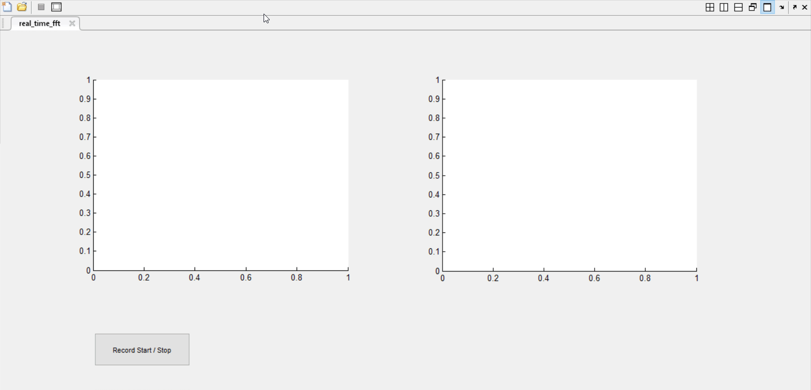

# Real-Time Audio Signal FFT in Matlab
This is an exercise for my Digital Signal Processing course.

Requirement: Write a small program in Matlab that records audio and displays the signal in real-time. Display in 2 plots, one in time-domain and the other in frequency-domain.

Demo:

The version of Matlab used is R2013b.
